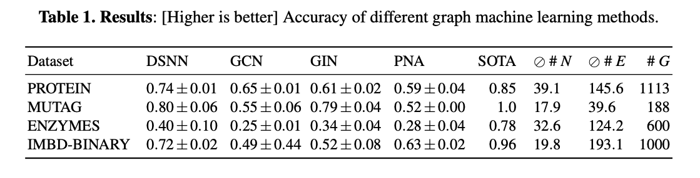

# Deep Set Neural Networks (DSNN)


This repository provides a proof-of-concept implementation for the manuscript _[Deep Sets Are Viable Graph Learners](https://github.com/gerritgr/DSNN/blob/8f469fe91e263cc29c466dd650424220dda97ee5/manuscript.pdf)_.

## DSNN Model
DSNN computes predictions on graphs, where the graph is represented as a multiset of nodes. Positional embeddings are computed using the following metrics:
- Centrality measures (e.g., betweenness, eigenvalue, laplacian centrality).
- The minimal distance to the node(s) with the highest/lowest centrality.
- The sum of neighboring nodes' features.

DSNN has two components (`MLP_1` and `MLP_2`), each with nine layers. These components have a latent dimension of 64 and utilize residual connections.

#### Baselines
For comparison, we employ models from _PyTorch Geometric_ as our baselines, specifically GIN, PNA, and GCN. These models are configured with five layers and a latent dimension of 64.

#### Results
The number of parameters and the accuracy (higher is better) of each model are:



## Run DSNN 

### Locally

You can run DSNN locally using _main.ipynb_. First, install Anaconda, then create an environment with the Python dependencies (tested on _OS X_):

```console
conda env create -f environment.yml -n dsnn
conda activate dsnn
jupyter lab
```
Then just run the notebook(s) from start to finish. 

### Via Docker
Install docker and then:
```console
docker pull gerritgr/dsnn:latest
docker run -p 8888:8888 gerritgr/dsnn:latest
```
You need to manually copy the URL to your browser, navigate to the notebook and ensure that the dsnnenv kernel is selected. 


## Errata
- The positional encodings contain a sum of the values of all neighboring nodes (not only of their positional encodings).
- Accuracy decreased due to a calculation error in the split of train/val/test compared to the revision version.
