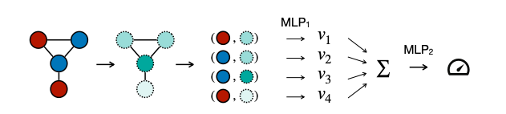

# Deep Set Neural Networks (DSNN)



This repository provides a proof-of-concept implementation for the manuscript _[Deep Sets Are Viable Graph Learners](https://github.com/gerritgr/DSNN/blob/ca3993605940b924c2a4a54a4673ee27353d6b7d/manuscript.pdf)_.

## DSNN Model
DSNN computes predictions on graphs, where the graph is represented as a multiset of nodes. Positional embeddings are computed using the following metrics:
- Centrality measures (e.g., betweenness, eigenvalue, laplacian centrality).
- The minimal distance to the node(s) with the highest/lowest centrality.
- The sum of neighboring nodes' features.

DSNN has two components (`MLP_1` and `MLP_2`), each with nine layers. These components have a latent dimension of 64 and utilize residual connections.

#### Baselines
For comparison, we employ models from _PyTorch Geometric_ as our baselines, specifically GIN, PNA, and GCN. These models are configured with five layers and a latent dimension of 64.

#### Results
The number of parameters and the accuracy (higher is better) of each model are:

| Dataset | Model  | # Params       |  ACC       |
|----------|--------|---------------|---------------|
| MUTAG    | DSNN   |    111553   |   0.8  | 
| MUTAG    | GIN    |     38017     | 0.74  |
| MUTAG    | PNA    |   273130    |  0.53 |
| MUTAG    | GCN    |      16961     | 0.53  |
|----------|--------|---------------|---------------|
| PROTEIN    | DSNN   |  106945     |  0.74 |
| PROTEIN    | GIN    |     37761     |  0.60 |
| PROTEIN    | PNA    | 269718      |  0.59 |
| PROTEIN    | GCN    |     17217      | 0.66  |
|----------|--------|---------------|---------------|
| ENZYMES    | DSNN   |     107590  |  0.4  |
| ENZYMES    | GIN    |     38086     |  0.37  |
| ENZYMES    | PNA    |   270043   |  0.25 |
| ENZYMES    | GCN    |    17286       | 0.27  |
|----------|--------|---------------|---------------|
| IMDB-BINARY    | DSNN   |  104641     |  0.72 |
| IMDB-BINARY    | GIN    |       37633   |  0.46 |
| IMDB-BINARY    | PNA    |  268036     |  0.6 |
| IMDB-BINARY    | GCN    |    16833      | 0.54  |

## Run DSNN Locally

You can run DSNN locally using _main.ipynb_. First, install Anaconda, then create an environment with the Python dependencies (tested on _OS X_):

```console
conda env create -f environment.yml -n dsnn
conda activate dsnn
jupyter lab
```
Then just run the notebook(s) from start to finish. 


## Errata
- The positional encodings contain a sum of the values of all neighboring nodes (not only of their positional encodings).
- Accuracy decreased due to a calculation error in the split of train/val/test compared to the revision version.
